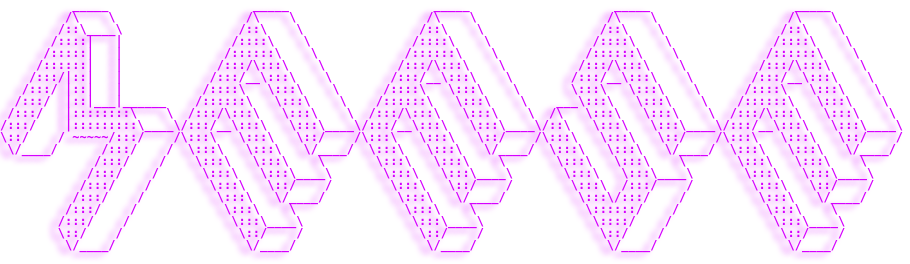

  

 

Meese Enterprises is a veteran-owned team of developers, designers, and content creators who are dedicated to providing the best possible experience to our customers.

## Why us?

What makes Meese Enterprises unique is our proclivity for Open Source Software (OSS). Creating code that is free to use, share, and modify is a key pillar of the software development community as a whole, and we strive to do our part in hopes to 'pass it on.'

We don't shy away from bootstrapping our projects from the amazing work of others, but we are firm believers in giving credit where credit is due. Nearly every segment of code that our developers have modified for their own use cases has a link to the original source, including helpful comments and code snippets from Stack Overflow.

<!--
We pride ourselves on our attention to detail, ...

MENTION SECURITY CLEARANCES
-->

<!--
## Qualifications

- Partner with [Delta Cloud Systems](https://www.deltacloudsystems.com/)
-->

<!--
**Here are some ideas to get you started:**

🙋‍♀️ A short introduction - what is your organization all about?
🌈 Contribution guidelines - how can the community get involved?
👩‍💻 Useful resources - where can the community find your docs? Is there anything else the community should know?
🍿 Fun facts - what does your team eat for breakfast?

**IDEAS:**
- A set of icons that can be muted on command to demonstrate how available the company currently is,
  including "Open to New Clients" and "Open to Inquiries".
  - Could also be used to show the company's current status, such as "Working with ABC company on XYZ."
- Case studies can be on a company Medium account, then the old Medium code can be used to pull and
  display them
- Can potentially use a Vercal app and API for all of these things
-->
